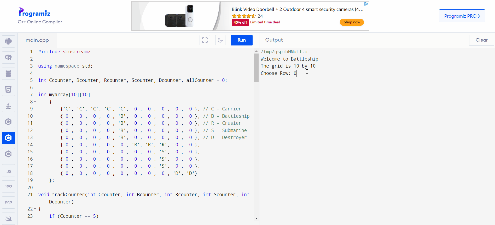

    

 
  

    

  
  

  
  

 
 

    

### About the hardware:
1) 1st Led is for Carrier ship and once you power the board it should be active.
2) 2nd Led is for Battle ship and once you power the board it should be active.
3) 3rd Led is for Cruiser ship and once you power the board it should be active.
4) 4th Led is for Submarine ship and once you power the board it should be active.
5) 5th Led is for Destroyer ship and once you power the board it should be active.
6) 6th Led is for Miss where once you target the ship and if ship doesnt exisit, it should active it.
7) 7th Led is for Input row where you have to input a row. It must be below 9; since the grid is 10 by 10.
8) 8th Led is for Column row where you have to input a column, It must be below 9; since the grid is 10 by 10.

### When the game starts
- The user needs to input the the row number they want to attack and press the button. If the number is less than or equal to 9, the user will get to input the column.
Otherwise, the input light will blink 3 times and will let the user to input it again.
- Once the row input is in. The column input light will be on. The user needs to input the column number and press the button. If the input is above 9, it will blink the light 3 times.
Otherwise it will proceed to the next step.
- The program will process the input and will fire back on of the either 1 to 5 leds. This will blink if the ship still has spaces left otherwise it will shut it off indicating that the ship has been sunk.
- If the program doesnt find anything it will blink the miss light one time indigating that the those cordinates dont have the ship.
- User has to sink all the ships in order to win and agter the win the lights will go in pattern indigating that the user has won.
- You can reset the play with the push of the black button on the nucleo.

 

    

<h3 align = "center">👩‍💻 Languages</h3>

  
  

<h2></h2>

<h3 align="center">🚀 Development Tools & Environments</h3>

  
  

<h2></h2>

<h3 align="center">⚙️ Hardware and Microcontroller Boards</h3>

  

 

    

- <a href = "#">Project Report</a>
